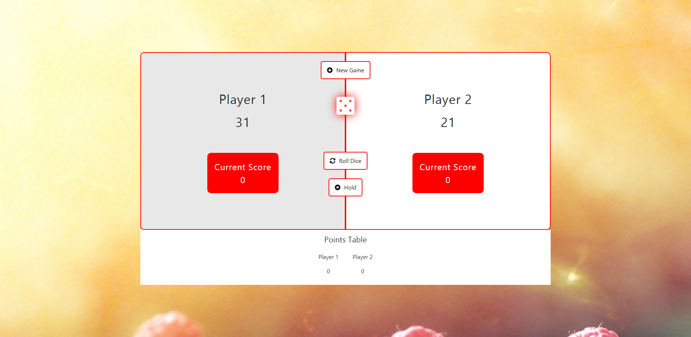

<h2>Dice Roll (Pig Game) Created Using HTML, CSS & JavaScript</h2>

<h3>How to Play?</h3>

<ul>
    <li>If the Player rolls a <b>1</b>, they score nothing and it becomes the next player's turn.</li>
    <li>If the player rolls any other number, it is added to their turn total and then player's turn continues.</li>
    <li>If a player chooses to "hold", their turn total is added to their score, and it becomes the next player's turn.</li>
    <li>The first player to score 100 or more points wins.</li>
</ul>

<h3>Screenshot</h3>

